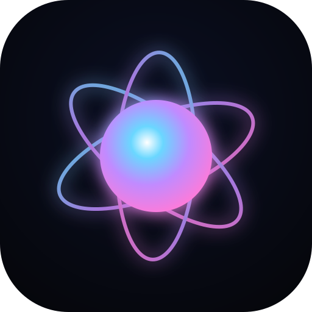

# LUMA · a living visualizer

A music- and touch-reactive WebGL2 visualizer designed to be **beautiful above
all else** — a flowing, ever-evolving field of light you can lose yourself in.
It opens straight into a living scene that **moves and changes on its own**, and
when you give it sound (your music or the mic) it comes alive to it. It **never
looks the same twice**.

Built to be **mobile-first** and almost chrome-free: the visualizer *is* the
page. The only controls are two tiny auto-hiding icons for sound. Touch paints.
Everything else — moods, palettes, intensity — happens automatically. Installs
to your home screen and runs fully offline. Zero runtime dependencies.



## What it does

- **Alive on its own** — no audio required. A domain-warped flowing field drifts
  and breathes, a starfield wanders, and it changes mood/palette by itself.
- **Reacts to music** — tap the note to open a track, or the mic to use live
  sound. A real-time FFT drives a radial spectrum ring, a bass-pumped core,
  beat-triggered bursts and treble shimmer, and the music's energy automatically
  sets the intensity. Bands auto-normalize so *any* track reacts well.
- **Reacts to you** — drag to paint glowing streaks, tap for sparks and ripples,
  press-and-hold for a charged burst. Your touches also bend the flow field.
- **Never the same** — a "director" continuously conducts the visuals through
  named moods (Nebula, Inferno, Aurora, Bioluminescence, Crystal, Kaleidobloom,
  Liquid Chrome, Ink, Prism…), crossfading palettes and drifting every variable
  on slow noise — all automatically.
- **Looks stunning** — an HDR pipeline: a domain-warped flowing color field,
  a feedback fluid for reactive trails, a GPU starfield (transform-feedback
  particles), kaleidoscope symmetry, bloom, ACES tone-mapping, chromatic
  aberration, vignette and film grain.

## Run it

It's a static site — no build step.

```bash
# any static server works; for example:
python3 -m http.server 8080
#  → open http://localhost:8080
```

You can also just open `index.html` directly in a browser. For mobile use,
host it anywhere (GitHub Pages, Netlify, etc.) and open it on your phone — then
use *Add to Home Screen* for a fullscreen, offline-capable app.

## Controls

There's barely any UI — it just runs. Two auto-hiding icons (bottom center) are
the only chrome; a play/pause appears only while a track is loaded.

| Action | Gesture / key |
| --- | --- |
| Paint streaks | drag anywhere |
| Spark + ripple | tap |
| Charged burst | press & hold, then release |
| Open a track | tap the **♪** icon |
| Live microphone | tap the **mic** icon · `M` |
| Play / pause (track) | **▶︎** icon · `Space` |
| Fullscreen | `F` |
| Hide UI | `H` (auto-hides when idle) |

Moods, palettes and intensity change on their own — there's no shuffle or
intensity control by design.

Append `#debug` to the URL for an on-screen FPS / band readout.

## How it works

Plain ES5-ish modules attached to a `VZ` namespace (no bundler), each a single
responsibility:

```
js/util.js       math · noise · color · envelopes
js/gl.js         WebGL2 helper (programs, float FBOs, ping-pong)
js/shaders.js    all GLSL (flow field, advect, inject, display, particles, bloom, composite)
js/audio.js      file / mic / generative sources + FFT, bands, beat detection
js/input.js      pointer & touch -> forces + gestures, device tilt
js/director.js   evolving parameter genome, moods, palettes, beat reactions
js/particles.js  GPU particles via transform feedback
js/renderer.js   the per-frame pipeline; combines director + audio + input
js/app.js        bootstrap, loop, UI wiring
```

Per frame: **advect** the feedback fluid → **inject** audio/touch sources →
**display** the flowing base field + fluid (kaleidoscoped) → update & draw
**particles** → **bloom** → **composite** (tone-map + grade).

## Tested

`npm test` runs a headless-Chrome smoke test (`test/smoke.js`) that boots the
app, compiles every shader on a real WebGL2 context, exercises touch and mood
changes, and checks the pipeline is actually rendering (not black, not blown
out). Requires `npm install` first (pulls Puppeteer's Chrome, dev-only).

## Browser support

Needs **WebGL2** and **Web Audio** — any recent Chrome, Safari, Edge or
Firefox on desktop or mobile. Degrades gracefully (LDR fallback if float render
targets are unavailable; particles disabled if transform feedback is missing).

## License

MIT.
